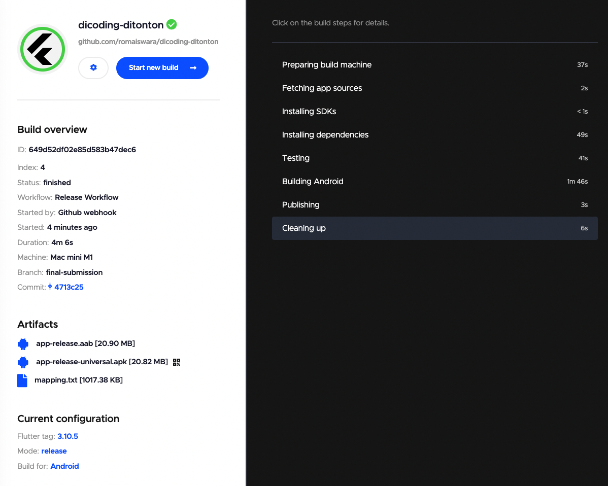

# Dicoding - Ditonton

## Task Submission

- Continuous Integration ✅
- Library BLoC ✅
- SSL Pinning ✅
- Firebase Analytics & Crashlytics ✅
- Modularisasi ✅

## Status Badge Codemagic

## Screenshoot

### Ci Service

### Crashlytics

